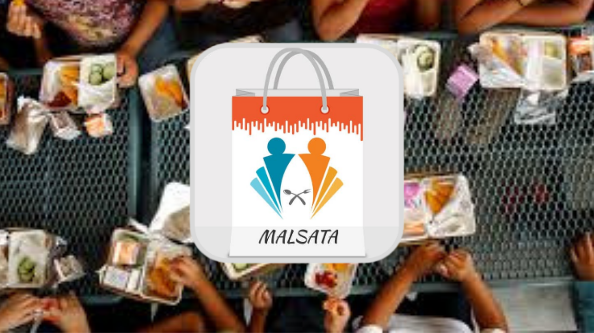
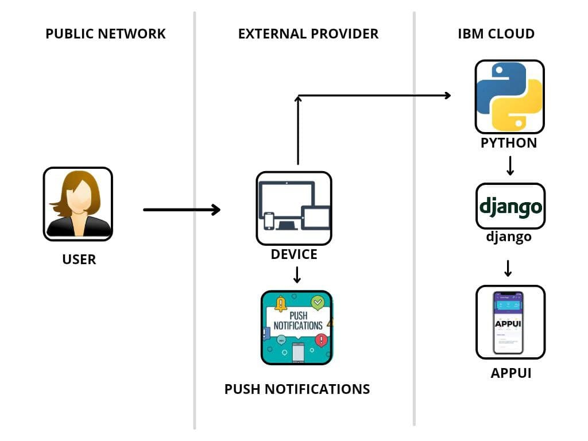

# Project Name
MALSATA

## Contents

- [Project Name](#project-name)
  - [Contents](#contents)
  - [Short description](#short-description)
    - [What's the problem?](#whats-the-problem)
    - [How can technology help?](#how-can-technology-help)
    - [The idea](#the-idea)
  - [Demo video](#demo-video)
  - [Long description](#long-description)
  - [Project roadmap](#project-roadmap)

## Short description
Let us make the world hunger free using Project MALSATA

### What's the problem?

We the team 'Agasthyas'introduce an app named 'MALSATA' to solve the problem. Millions of People die because of hunger.Hunger is the worstest situation ever we face today. It is a stage of lack of food. The main cause of hunger worldwide is poverty.

### How can our technology help?

At times when deaths due to hunger are increasing day by day digital technology could help put more food on oru country table. Where people are facing hunger and malnutrition, a basic form of technology — the mobile phone or a computer can be used to generate data that helps relief oru team to make better decisions on where to distribute food aid. Mobile technology also facilitates the delivery of new forms of food assistance. Here we introduce the application MALSATA to solve the problems of hunger, as it aims at delivering food to all people free of cost

### The idea: How the App works?

When any one come asking for food through our app MALSATA implemented at every post office (post office employee incharge with handling MALSATA) can order the food according to their needs. This information will direct go to Food Collection Centres like Community Kitchens , Restaurants etc.. who are already registered in this app as per the service traffic. The one who accept the request first get the chance to place the order and when the request is accepted by the collection centre  the address details of both the collection centre and post office goes to the delivery team (Here, the delivery team will be social service groups). The Delivery team of MALSATA collects the food from Community Kitchens/Restaurants and deliver the order to the corresponding post office.

## Demo video

## Long description

[More detail is available here](./docs/DESCRIPTION.md)

## Project roadmap

